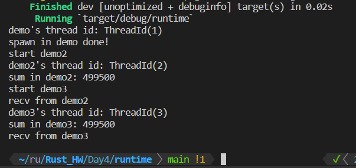

# My Runtime

## Introduction

实现了一个简单的异步runtime, 支持多线程

## Test

`main.rs` 中就是一个使用多线程的实例.通过主函数调用`demo()`函数,并在其中开启两个新线程,分别执行`demo2()` 和`demo3()`.
两者中都包含了一个`for`循环来占据计算资源,并在最后输出`sum`.

从输出中不难发现,三个demo是运行在不同的thread上(1,2,3).
