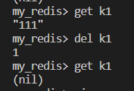

# MyRedis

## Introduction

This project implements a simple `Redis` by using `volo`.

It contains the following commands:
    
* Set
* Get
* Del
* Ping
* subscribe
* publish

And it also contains the `fliter` which will reject requests who has contains `1919810` or `114514`.

It also implements a simple `client-cli`, if I didn't misunderstand the meaning.

## Description

### Set
```bash
set key value [EX/PX] [TIME]
```

Add the `key` and `value` to the `HashMap`, you'd better surround the value by `"(quotes)`, because some space in the string can be very hard to deal with.

And you can set the expiration time of the key by adding `EX/PX`, `EX` is in seconds while `PX` is in milliseconds.

```bash
set key1 "hello world" EX 1
```

### Get
```bash
get key
```
It will return the value of the key if it exists, otherwise it will output `(nil)`


### Ping
```bash
ping //return PONG
ping string //return the copy of string
```
You are also required to surround the string by `"(quotes)`.\

### Del
```bash
del key1 [key2 ...]
```

You can delete `one or more` keys in one times. And it will return the number of keys being deleted.

The left one is show the key visited after deletion. The right one is to show delete many keys in one time.\



### Subscribe and publish
Publish to a channel without subscribing will return 0.

The `subscribe` can keep listening to the channel, as is shown below, however to stop without quitting the client needs listening to the keyboard and I didn's implement it.


### exit

You can exit the client by typing `exit`.

### Fliter

When the argument contains `1919810` or `114514`  😁, it will reject the request.

